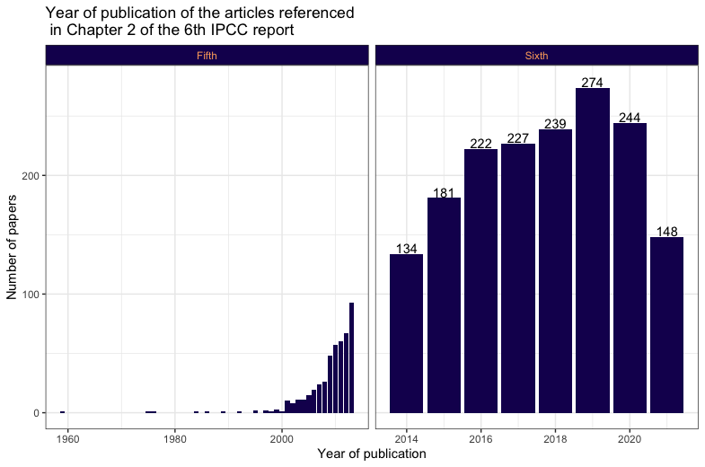

# ipcc-publication
This repo contains the R code to extract text from a pdf.
In this case the text of interest are the years of publication of the references in Chapter 2 of the 6th IPCC Report.

>This morning I started to read Chapter 2 of the #IPCC report: Terrestrial and freshwater ecosystems and their services.
As I was reading I got the feeling that most of the publications were more than 3 years old. I am aware of how much iteration goes into these reports, so I was not surprised by my feeling. I decided to double check and extracted the date of the publications referenced in the chapter. I concluded my feeling was the wrong one.